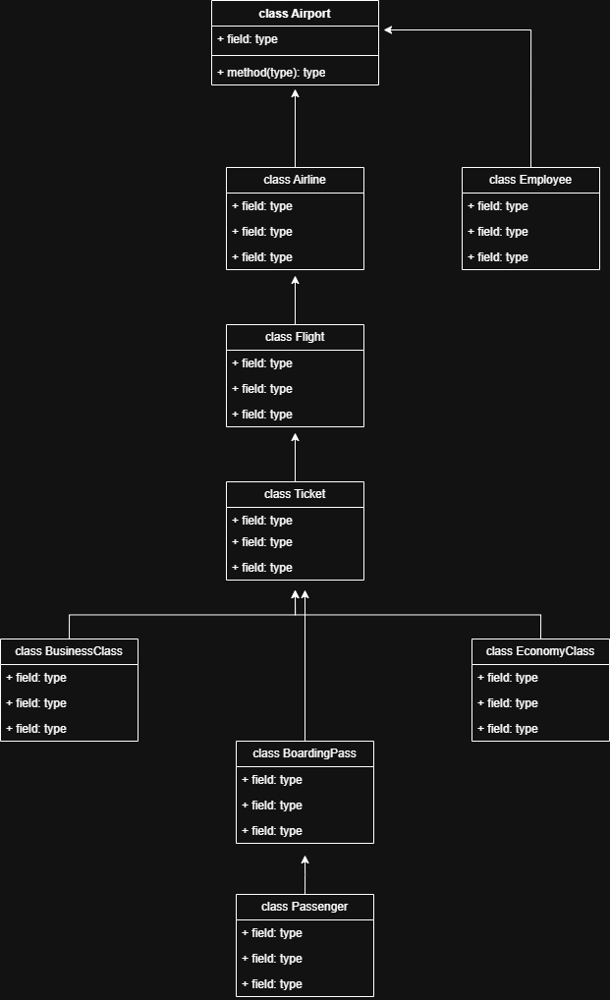

# ✈️ Airline Ticket Management System OOP

A C++ console-based airline ticket management project created to demonstrate the fundamentals of Object-Oriented Programming.

The system models real-world airline entities such as passengers, tickets, flights, boarding passes, airlines, employees, and airports using C++ classes and object relationships.

---

## 📌 Project Overview

The **Airline Ticket Management System** is an academic C++ project focused on Object-Oriented Programming concepts rather than a full commercial airline booking system.

The project represents a simplified airline environment where passenger details are stored in objects, ticket information is generated using route data, flight and boarding pass details are displayed, airline and airport entities are connected with ticket information, and inheritance is used for ticket categories.

---

## 🎯 Purpose of the Project

The main purpose of this project is to demonstrate:

- Class design
- Object creation
- Encapsulation
- Constructors
- Inheritance
- Object composition
- Association between classes
- Basic console output formatting

It is not designed as a complete booking platform with databases, payment gateways, real-time seat availability, or authentication. It is a learning-focused OOP implementation.

---

## ✨ Features

### 1. Passenger Management

The `Passenger` class stores passenger information such as name, age, and CNIC. Getter and setter functions are used to demonstrate encapsulation.

### 2. Employee Information

The `Employee` class models basic airport or airline staff information including employee name, position, and ID.

### 3. Flight Details

The `Flight` class stores flight number, departure time, and arrival time.

### 4. Ticket Generation

The `Ticket` class connects a passenger with departure and arrival city information. It displays ticket prices based on predefined routes.

### 5. Boarding Pass

The `BoardingPass` class combines passenger information, flight information, and seat number to represent a boarding pass.

### 6. Airline and Airport Details

The project includes `Airline` and `Airport` classes to represent airline and airport-level information.

### 7. Ticket Categories

The project includes derived classes such as `BusinessClassTicket` and `EconomyClassTicket` to demonstrate inheritance from the base `Ticket` class.

---

## 🧠 OOP Concepts Demonstrated

| Concept | Implementation |
|---|---|
| Classes | Passenger, Employee, Flight, Ticket, Airline, Airport, BoardingPass |
| Objects | Real examples created inside `main()` |
| Encapsulation | Private data members with getter/setter methods |
| Constructors | Used to initialize class attributes |
| Composition | BoardingPass contains Passenger and Flight objects |
| Association | Airline uses Ticket information |
| Inheritance | BusinessClassTicket and EconomyClassTicket inherit from Ticket |
| Method Reuse | Derived classes reuse base ticket behavior |
| Console Output | Details displayed using member functions |

---

## 📊 Class Diagram

The repository includes a class diagram file:

```text
class_diagram.png
```

If the image exists in the repository, GitHub will display it below:



---

## 🛠️ Tech Stack

| Category | Technology |
|---|---|
| Programming Language | C++ |
| Interface | Console / Terminal |
| Programming Style | Object-Oriented Programming |
| Compiler | g++ / MinGW / Code::Blocks / Dev-C++ |

---

## 📁 Project Structure

```text
Airline-Ticket-Management-System-OOP/
│
├── airline_management.cpp
├── class_diagram.png
└── README.md
```

---

## 🚀 How to Run Locally

### 1. Install a C++ Compiler

You can use g++, MinGW, Code::Blocks, Dev-C++, or VS Code with the C++ extension.

```bash
g++ --version
```

### 2. Clone the Repository

```bash
git clone https://github.com/fayzliaqat/Airline-Ticket-Management-System-OOP.git
cd Airline-Ticket-Management-System-OOP
```

### 3. Compile the Program

```bash
g++ airline_management.cpp -o airline_management
```

### 4. Run the Program

#### Windows

```bash
airline_management.exe
```

#### macOS / Linux

```bash
./airline_management
```

---

## 🧪 Example Output

```text
Ticket Details:
Name: Leo Messi
Age: 37
CNIC: 1234567890
Departure: Lahore
Arrival: Karachi
Ticket Price: 35000

Boarding Pass Details:
Flight Number: PK-303
Departure Time: 10:00 AM
Arrival Time: 12:00 PM
Seat Number: 15A
```

---

## ✅ Current Status

This project is complete as an academic Object-Oriented Programming assignment. It demonstrates the main OOP concepts through a simple airline ticket system.

---

## ⚠️ Limitations

- Uses hardcoded sample data
- No interactive menu
- No file handling
- No database
- No real seat reservation logic
- No passenger input system
- No ticket cancellation system
- Console-based only

---

## 🔮 Future Improvements

- Add a menu-driven interface
- Take passenger input from the user
- Store ticket records in files
- Add seat availability checking
- Add ticket cancellation
- Add multiple airlines and flights
- Separate classes into header and source files
- Improve validation for CNIC, seat number, and route names
- Add database support in the future

---

## 👨‍💻 Author

**Fayz Liaqat**  
Artificial Intelligence Student
